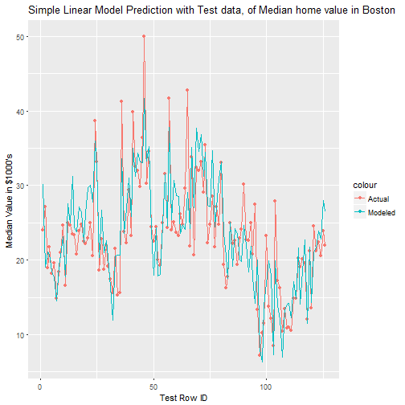
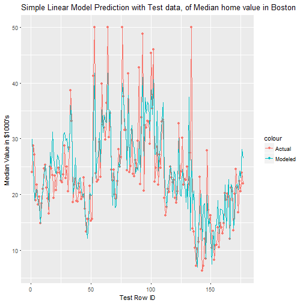

## Training sampling App Description

1. The main function of the traning sampling app is to determine the best percentage to sample for building a model.  
2. This app uses, R's Boston dataset. Which has median home values and other 
   features from 1978
3. This app generates a simple linear model from a trainset determined by the percentage in the slider. It uses
   the generated model to predict the "Median value of owner occupied homes" on the remaining holdout or testset data.
   The prediction is then presented visually with a plot between the "Actual' median value in the testset and the
   model predicted "Modeled" value for the testset.
   A R-Squared value is also presented to show the quality of the fit, whose value range from 0 to 1. Higher R Squared
   usually represents a better fit. We use this and the fit of the chart to determine the sampling percentage.
4. The percentage determined could then be used to do other detailed analysis and modeling using advance machine learning algorithms.   

--- .class #id 
## Results of sampling with 75% training data


```
## [1] "Test R Squared: 0.742628367165728"
```



---

## Results of sampling with 65% training data 

```
## [1] "Test R Squared: 0.741000486277999"
```



---
## Conclusion
Based on the R-Squared value from the sampling with a simple linear
model this app helps in deciding the appropriate training set.

Thank You
